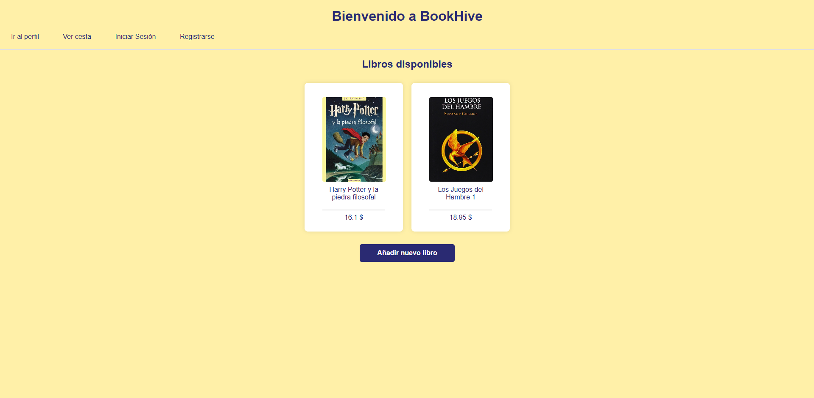
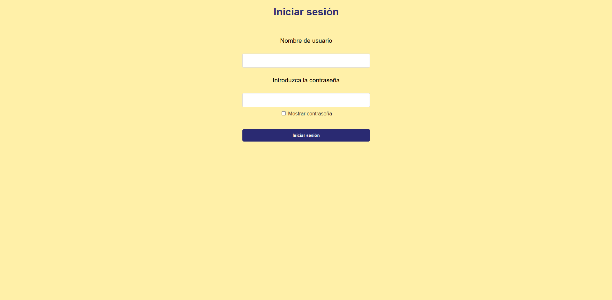
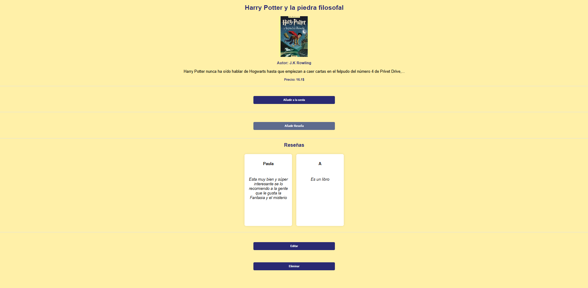
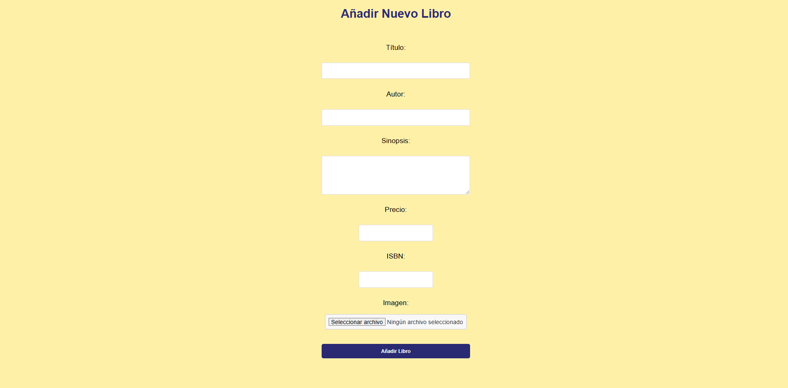
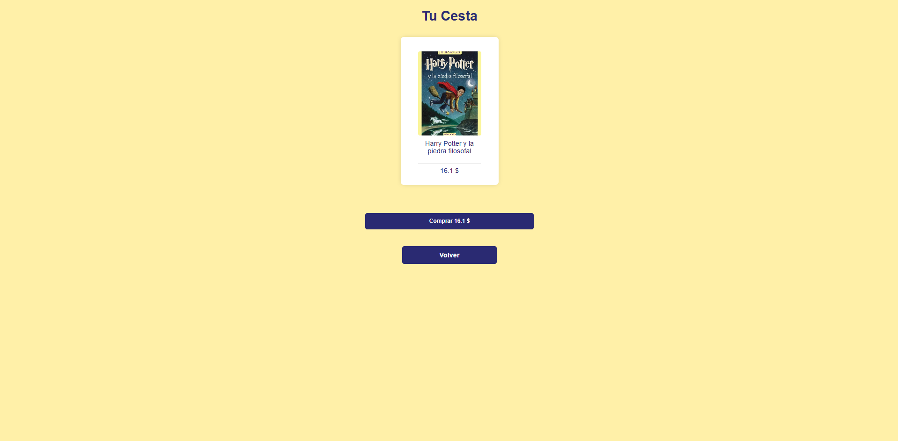
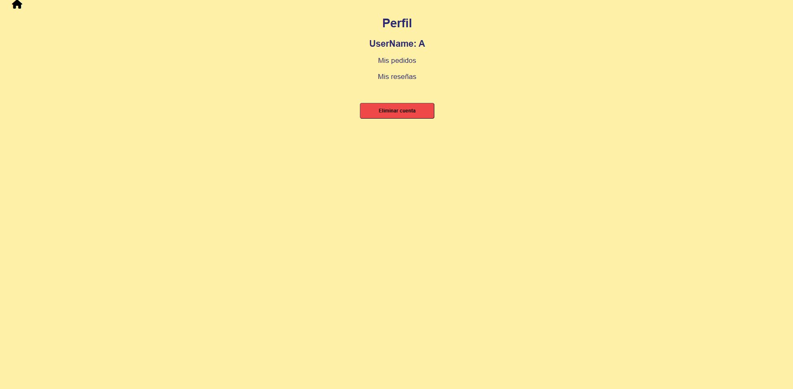
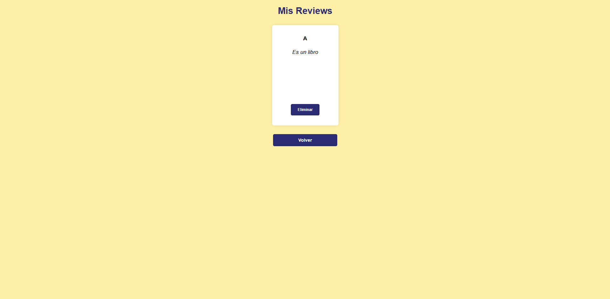
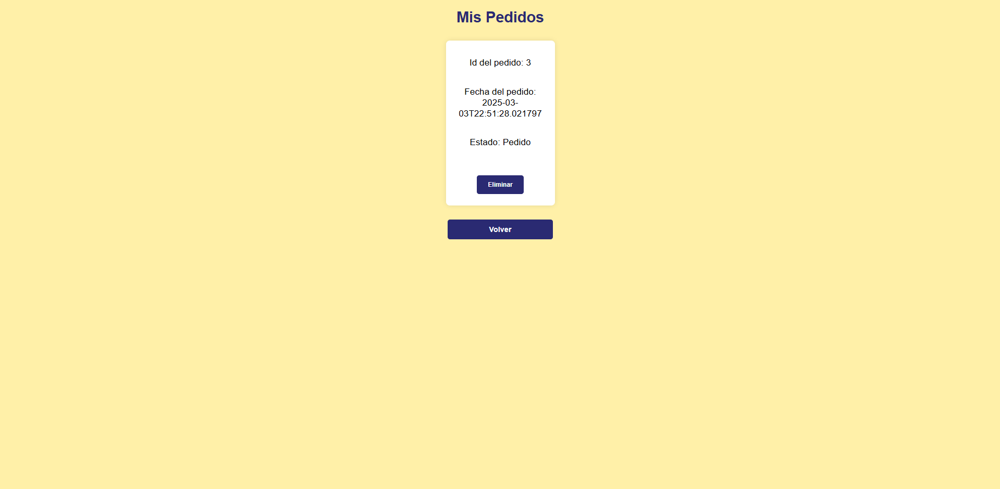
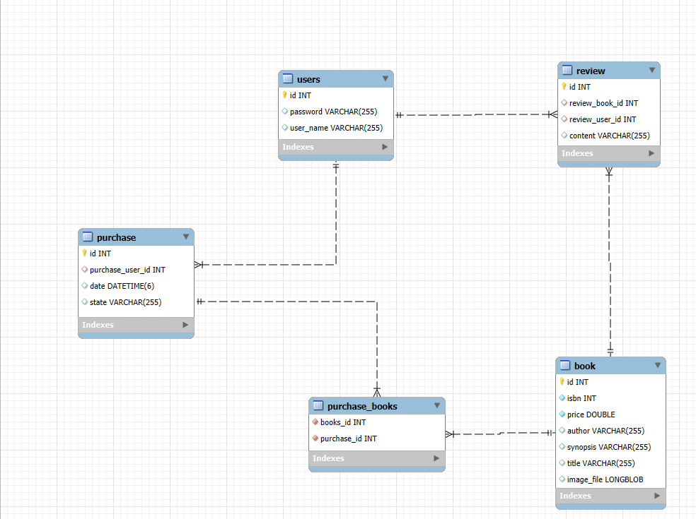
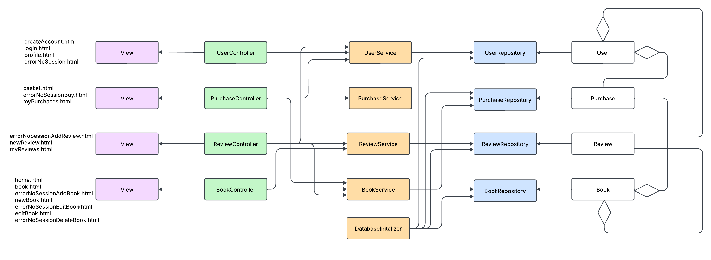

# BookHive
## Integrantes del grupo
| Nombre                  | Correo                            | Usuario GitHub |
|-------------------------|-----------------------------------|----------------|
| Paula Fernández Pérez   | p.fernandezp.2022@alumnos.urjc.es | Paulaferpe               |
| Lucía Galán Galán       | l.galang.2019@alumnos.urjc.  es     |    Luciagalan38            |
| Rubén Camacho Rodríguez | r.camacho.2022@alumnos.urjc.es    | RubenCamach0   |

## Entidades
* **Usuario**
* **Libro**
* **Reseña**
* **Pedido**
### Relaciones de entidades
* **OneToMany Book -> Review**
* **ManyToOne Purchase -> User**
* **ManyToMany Purchase -> Book**
* **ManyToOne Review -> User**
* **ManyToOne Review -> Book**
* **OneToMany User -> Review**
* **OneToMany User -> Purchase**

## Permisos de los usuarios
* **Usuario anónimo:** podrá ver los libros del catálogo, las reseñas de estos libros y añadir libros al carrito sin la posibilidad de realizar la compra o escribir reseñas.
* **Usuario registrado:** podrá realizar pedidos de libros y escribir reseña sobre los libros.
* **Usuario administrador:** tendrá control total sobre la aplicació, pudiendo añadir, editar y eliminar libros.
## Imágenes
* **Libros:** portada del libro.

## Navegación
### Pantalla de inicio

Desde esta pantalla se puede acceder a los libros de la librería, a la pantalla de inicio de sesión y registarse, a tu perfil y a tu cesta, además de poder añadir un libro a la página. 
### Pantalla de Crear cuenta

Desde esta pantalla podrás crear un nuevo usuario introducciendo tus datos.
### Pantalla de Inicio de sesión

Desde esta pantalla podrás iniciar sesión en la aplicación.
### Pantalla de un libro

En esta pantalla podrás ver la información y las reseñas del libro seleccionado, además podrás añadir una reseña, agregar el libro a tu cesta. Tambieén podrás editar y eliminar el libro. 
### Pantalla Añadir libro

Desde esta pantalla podrás crear y añadir un libro nuevo a la aplicación proporcionando la información necesaria sobre dicho libro. 
### Pantalla Editar libro 

En esta pantalla podrás editar la información sobre el libro seleccionado. 
### Pantalla de la cesta

En esta pantalla podrás ver los libros que tienes en tu cesta, con el precio de cada uno y el precio total, además podrás comprar dichos libros o volver hacia la pantalla de inicio para seguir comprando. 
### Pantalla de perfil 

En esta pantalla podrás ver tu nombre de usuario, y acceder a tus pedidos anteriores y a las reseñas que has realizado, además tendrás la posibilidad de eliminar tu cuenta. 
### Pantalla de mis reseñas 

En esta pantalla podrás ver y eliminar tus reseñas. 
### Pantalla de mis pedidos 

En esta pantalla podrás ver y eliminar tus pedidos. 
## Instrucciones de ejecución 
## Diagrama con las entidades de la base de datos 

## Diagrama de clases y templates

## Participación de miembros
### **Paula Fernández Pérez**
Todo lo relacionado con la entidad User, es decir, la propia entidad User, UserController, UserRepository y UserService. En cuanto a los templates, la realización createAccount.html, login.html, profile.html, users.html, errorNoSessionAddReview.html, errorNoSessionBuy.html y errorNoSessionDeletebok.html. 
* Principales commits: 
    - EntityUser :https://github.com/SSDD-2025/practica-sistemas-distribuidos-2025-grupo-15/commit/d840f849462e04d9b42c35148232cf0a8425eedc 
    - User Service: https://github.com/SSDD-2025/practica-sistemas-distribuidos-2025-grupo-15/commit/a6a61a56f4c06d89d0dc87fe866c2d189b5f447d
    - User Controller/Create account: https://github.com/SSDD-2025/practica-sistemas-distribuidos-2025-grupo-15/commit/b1a875f5910f37dd630669b6aa06260698775cfa
    - User Controller login: https://github.com/SSDD-2025/practica-sistemas-distribuidos-2025-grupo-15/commit/dd95726192be9e92a00366815dd039c881509251
    - More errorNoSession pages: https://github.com/SSDD-2025/practica-sistemas-distribuidos-2025-grupo-15/commit/6abecb6ce4a6490eac43841791af4a2e2dd54715

* Ficheros importantes: 
    - UserController: https://github.com/SSDD-2025/practica-sistemas-distribuidos-2025-grupo-15/blob/main/demo/src/main/java/com/example/demo/controller/UserController.java
    - User: https://github.com/SSDD-2025/practica-sistemas-distribuidos-2025-grupo-15/blob/main/demo/src/main/java/com/example/demo/model/User.java
    - UserRepository: https://github.com/SSDD-2025/practica-sistemas-distribuidos-2025-grupo-15/blob/main/demo/src/main/java/com/example/demo/repository/UserRepository.java
    - UserService: https://github.com/SSDD-2025/practica-sistemas-distribuidos-2025-grupo-15/blob/main/demo/src/main/java/com/example/demo/service/UserService.java
    - createAccount.html: https://github.com/SSDD-2025/practica-sistemas-distribuidos-2025-grupo-15/blob/main/demo/src/main/resources/templates/createAccount.html
* **Lucía Galán Galán**
* **Rubén Camacho Rodriguez**

