# BookHive
## Integrantes del grupo
| Nombre                  | Correo                            | Usuario GitHub |
|-------------------------|-----------------------------------|----------------|
| Paula Fernández Pérez   | p.fernandezp.2022@alumnos.urjc.es | Paulaferpe               |
| Lucía Galán Galán       | l.galang.2019@alumnos.urjc.es     |    Luciagalan38            |
| Rubén Camacho Rodríguez | r.camacho.2022@alumnos.urjc.es    | RubenCamach0   |

## Entidades
* **Usuario**
* **Libro**
* **Reseña**
* **Pedido**
### Relaciones de entidades
* **OneToMany Book -> Review**
* **ManyToOne Purchase -> User**
* **ManyToMany Purchase -> Book**
* **ManyToOne Review -> User**
* **ManyToOne Review -> Book**
* **OneToMany User -> Review**
* **OneToMany User -> Purchase**

## Permisos de los usuarios
* **Usuario anónimo:** podrá ver los libros del catálogo, las reseñas de estos libros y añadir libros al carrito sin la posibilidad de realizar la compra o escribir reseñas.
* **Usuario registrado:** podrá realizar pedidos de libros, escribir reseña sobre los libros y editar su perfil. 
* **Usuario administrador:** tendrá control total sobre la aplicació, pudiendo añadir, editar y eliminar libros.
## Imágenes
* **Libros:** portada del libro.

## Navegación
### Pantalla de inicio
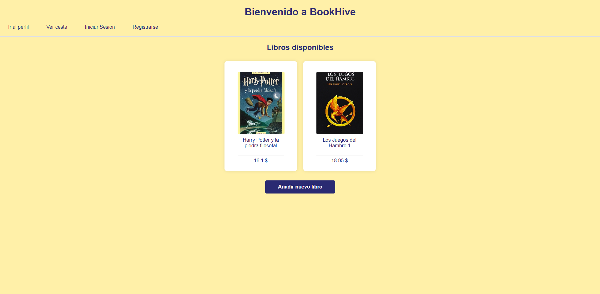
Desde esta pantalla se puede acceder a los libros de la librería, a la pantalla de inicio de sesión y registarse, a tu perfil y a tu cesta, además de poder añadir un libro a la página. 
### Pantalla de Crear cuenta
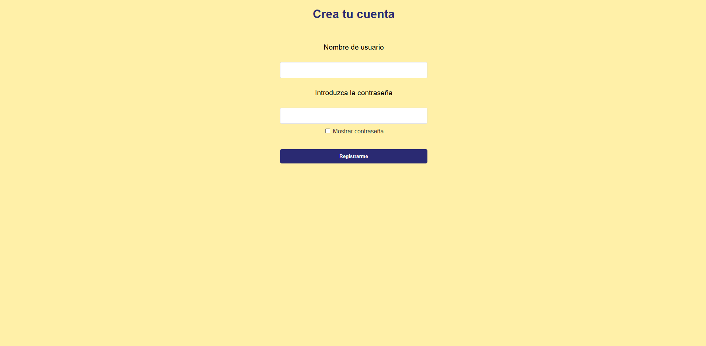
Desde esta pantalla podrás crear un nuevo usuario introducciendo tus datos.
### Pantalla de Inicio de sesión
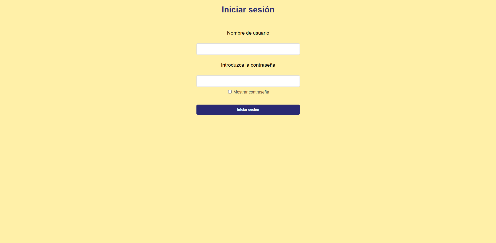
Desde esta pantalla podrás iniciar sesión en la aplicación.
### Pantalla de un libro
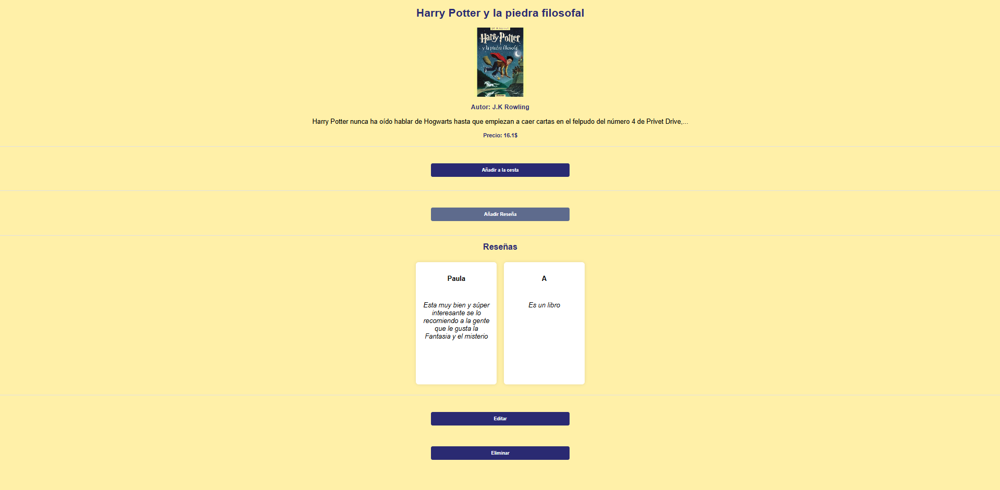
En esta pantalla podrás ver la información y las reseñas del libro seleccionado, además podrás añadir una reseña, agregar el libro a tu cesta. Tambieén podrás editar y eliminar el libro. 
### Pantalla Añadir libro
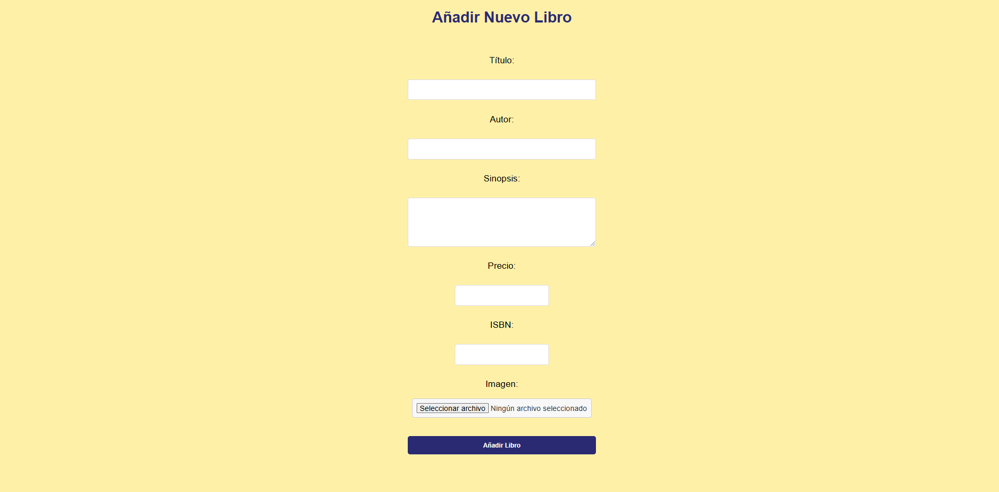
Desde esta pantalla podrás crear y añadir un libro nuevo a la aplicación proporcionando la información necesaria sobre dicho libro. 
### Pantalla Editar libro 
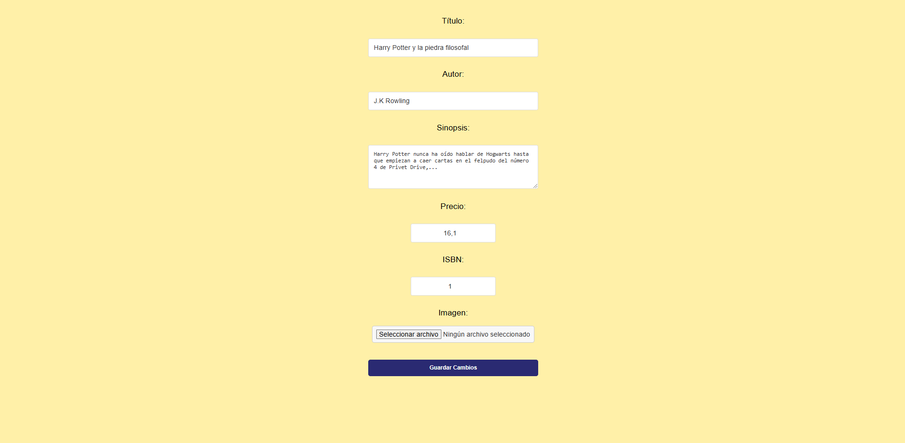
En esta pantalla podrás editar la información sobre el libro seleccionado. 
### Pantalla nueva reseña
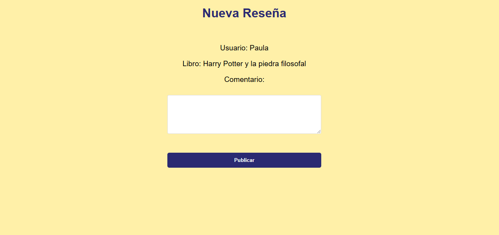
En esta pantalla podrás realizar una reseña sobre el libro que has seleccionado, la cual quedará guardada.
### Pantalla de la cesta
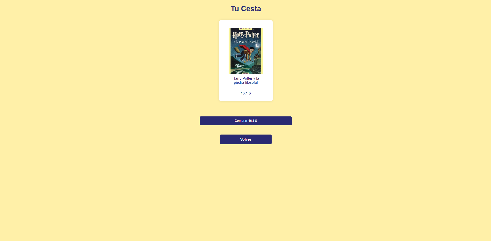
En esta pantalla podrás ver los libros que tienes en tu cesta, con el precio de cada uno y el precio total, además podrás comprar dichos libros o volver hacia la pantalla de inicio para seguir comprando. 
### Pantalla de perfil 
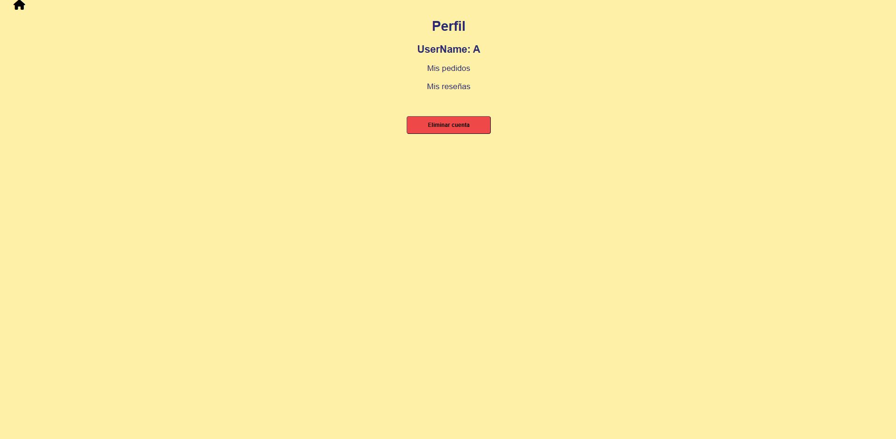
En esta pantalla podrás ver tu nombre de usuario, y acceder a tus pedidos anteriores y a las reseñas que has realizado, además tendrás la posibilidad de eliminar tu cuenta. 
### Pantalla de mis reseñas 
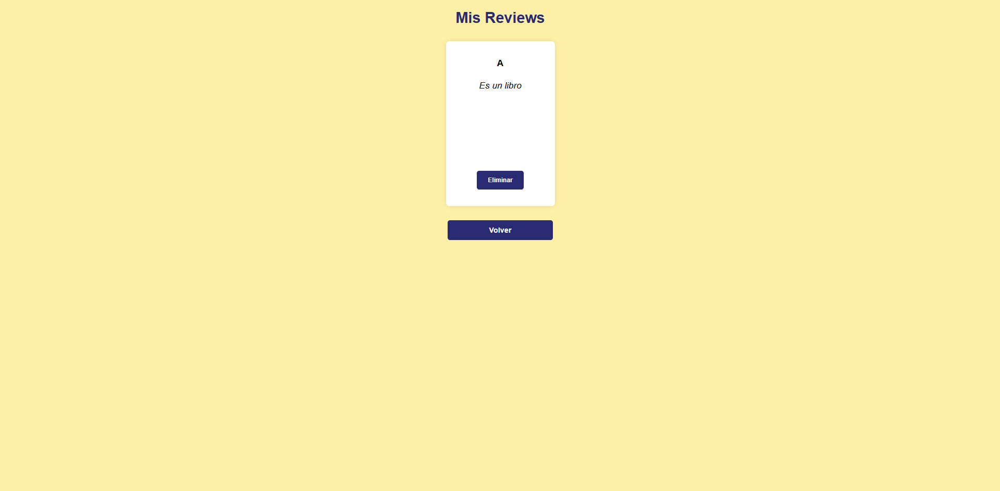
En esta pantalla podrás ver y eliminar tus reseñas. 
### Pantalla de mis pedidos 
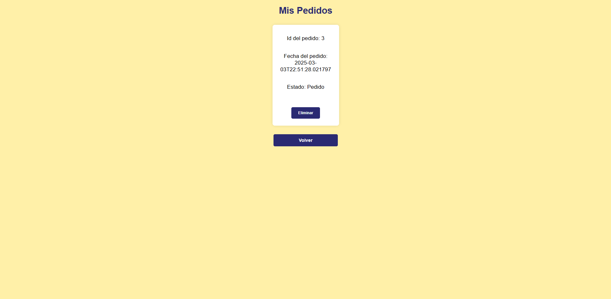
En esta pantalla podrás ver y eliminar tus pedidos. 
### Diagrama de navegación 
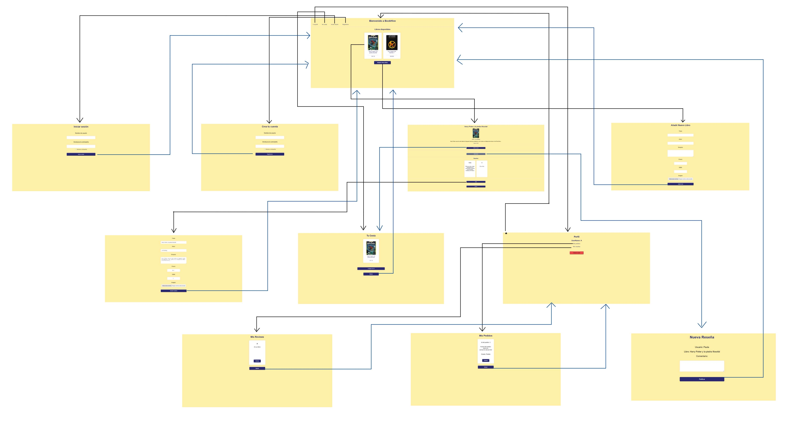
## Instrucciones de ejecución 
## Diagrama con las entidades de la base de datos 
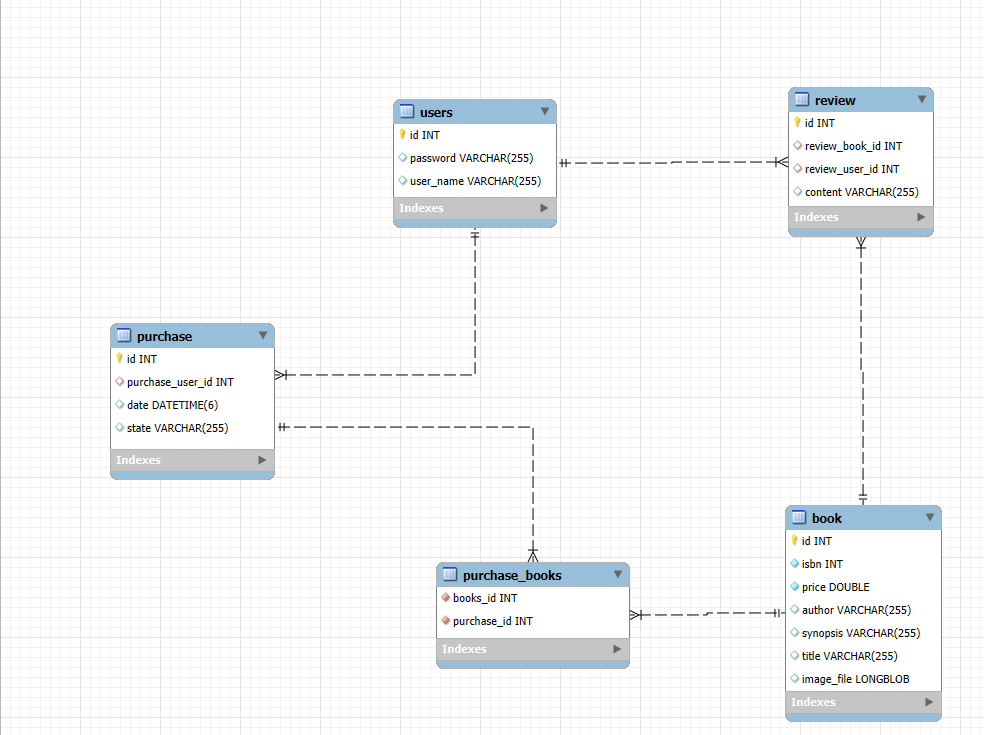
## Diagrama de clases y templates
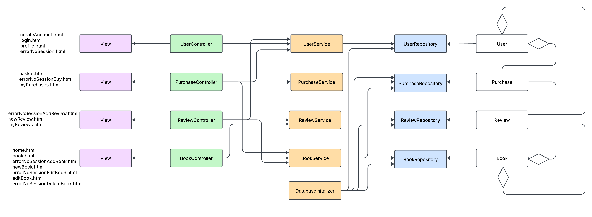
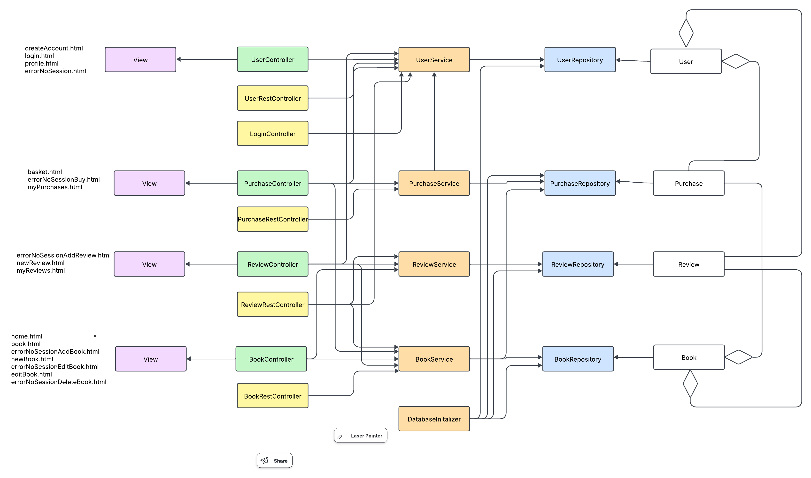
## Participación de miembros Parte 1 
### **Paula Fernández Pérez**
Todo lo relacionado con la entidad User, es decir, la propia entidad User, UserController, UserRepository y UserService. En cuanto a los templates, la realización createAccount.html, login.html, profile.html, users.html, errorNoSessionAddReview.html, errorNoSessionBuy.html y errorNoSessionDeletebok.html. 
* Principales commits: 
    - EntityUser :https://github.com/SSDD-2025/practica-sistemas-distribuidos-2025-grupo-15/commit/d840f849462e04d9b42c35148232cf0a8425eedc 
    - User Service: https://github.com/SSDD-2025/practica-sistemas-distribuidos-2025-grupo-15/commit/a6a61a56f4c06d89d0dc87fe866c2d189b5f447d
    - User Controller/Create account: https://github.com/SSDD-2025/practica-sistemas-distribuidos-2025-grupo-15/commit/b1a875f5910f37dd630669b6aa06260698775cfa
    - User Controller login: https://github.com/SSDD-2025/practica-sistemas-distribuidos-2025-grupo-15/commit/dd95726192be9e92a00366815dd039c881509251
    - More errorNoSession pages: https://github.com/SSDD-2025/practica-sistemas-distribuidos-2025-grupo-15/commit/6abecb6ce4a6490eac43841791af4a2e2dd54715

* Ficheros importantes: 
    - UserController: https://github.com/SSDD-2025/practica-sistemas-distribuidos-2025-grupo-15/blob/main/demo/src/main/java/com/example/demo/controller/UserController.java
    - User: https://github.com/SSDD-2025/practica-sistemas-distribuidos-2025-grupo-15/blob/main/demo/src/main/java/com/example/demo/model/User.java
    - UserRepository: https://github.com/SSDD-2025/practica-sistemas-distribuidos-2025-grupo-15/blob/main/demo/src/main/java/com/example/demo/repository/UserRepository.java
    - UserService: https://github.com/SSDD-2025/practica-sistemas-distribuidos-2025-grupo-15/blob/main/demo/src/main/java/com/example/demo/service/UserService.java
    - createAccount.html: https://github.com/SSDD-2025/practica-sistemas-distribuidos-2025-grupo-15/blob/main/demo/src/main/resources/templates/createAccount.html
### **Lucía Galán Galán**
Todo lo relacionado con la entidad Book, es decir, la propia entidad Book, BookController, BookRepository y BookService. En cuanto a los templates, la realización de book.html, editBook.html, home.html, newBook.html, errorNoSessionAddBook.html, errorNoSession.html y errorNoSessionEditbook.html. También, la gestión de imágenes para la entidad Libro.

* Principales commits: 

    - Entidad Book y BookRepository : https://github.com/SSDD-2025/practica-sistemas-distribuidos-2025-grupo-15/commit/e8b3d0b1244d7b02529031adc16537f9aa10e301
    - Book Service: https://github.com/SSDD-2025/practica-sistemas-distribuidos-2025-grupo-15/commit/bc7e807ebdade0f90ef8b0e70516e6fd4f73200f
    - Book Controller: https://github.com/SSDD-2025/practica-sistemas-distribuidos-2025-grupo-15/commit/cf21beccbc391751e9bbeb25ab20eb0fec119f94
    - Book Images: https://github.com/SSDD-2025/practica-sistemas-distribuidos-2025-grupo-15/commit/0dd096a5fabd3ee64be956907032b2fa9e0a100f
    - Add errorNoSession pages: https://github.com/SSDD-2025/practica-sistemas-distribuidos-2025-grupo-15/commit/a692b81bfdd69f338c5cdd538baf247104bdc49a

* Ficheros importantes: 
    - BookController: https://github.com/SSDD-2025/practica-sistemas-distribuidos-2025-grupo-15/blob/main/demo/src/main/java/com/example/demo/controller/BookController.java
    - Book: https://github.com/SSDD-2025/practica-sistemas-distribuidos-2025-grupo-15/blob/main/demo/src/main/java/com/example/demo/model/Book.java
    - BookRepository: https://github.com/SSDD-2025/practica-sistemas-distribuidos-2025-grupo-15/blob/main/demo/src/main/java/com/example/demo/repository/BookRepository.java
    - BookService: https://github.com/SSDD-2025/practica-sistemas-distribuidos-2025-grupo-15/blob/main/demo/src/main/java/com/example/demo/service/BookService.java
    - home.html: https://github.com/SSDD-2025/practica-sistemas-distribuidos-2025-grupo-15/blob/main/demo/src/main/resources/templates/home.html
### **Rubén Camacho Rodríguez**
Todo lo relacionado con las entidades Review y Purchase, es decir, las entidades Review y Purchase, ReviewRepository y PurchaseRepository, ReviewService y PurchaseService, ReviewController y PurchaseController. En cuanto a los templates, la realización basket.html, myPurchases.html, myReviews.html y newReview.html.

* Principales commits:
    - Entity Order + Order Repository: https://github.com/SSDD-2025/practica-sistemas-distribuidos-2025-grupo-15/commit/673b591424dd73104840ed3bd9b7c0581bb7d27c
    -ReviewService: https://github.com/SSDD-2025/practica-sistemas-distribuidos-2025-grupo-15/commit/3add2861773aeb5a83f853e5d82a1763e2745bd0
    -Change Order to Purchase: https://github.com/SSDD-2025/practica-sistemas-distribuidos-2025-grupo-15/commit/4a6cae40c236d3f438e0d211f23f4af0491ad953
    -Basket Controller: https://github.com/SSDD-2025/practica-sistemas-distribuidos-2025-grupo-15/commit/32f82d79e94651ac0e8f0b0500a3d95eebd28d2b
    -MyReviews Controller: https://github.com/SSDD-2025/practica-sistemas-distribuidos-2025-grupo-15/commit/29b086df2e2ab95310b3d4d21dc8a80fe83d0805

* Ficheros importantes:
    - PurchaseController: https://github.com/SSDD-2025/practica-sistemas-distribuidos-2025-grupo-15/blob/main/demo/src/main/java/com/example/demo/controller/PurchaseController.java
    - ReviewController: https://github.com/SSDD-2025/practica-sistemas-distribuidos-2025-grupo-15/blob/main/demo/src/main/java/com/example/demo/controller/ReviewController.java
    - PurchaseService: https://github.com/SSDD-2025/practica-sistemas-distribuidos-2025-grupo-15/blob/main/demo/src/main/java/com/example/demo/service/PurchaseService.java
    - ReviewService: https://github.com/SSDD-2025/practica-sistemas-distribuidos-2025-grupo-15/blob/main/demo/src/main/java/com/example/demo/service/ReviewService.java
    - basket.html: https://github.com/SSDD-2025/practica-sistemas-distribuidos-2025-grupo-15/blob/main/demo/src/main/resources/templates/basket.html

### Commits grupales
Algunos de los commits se realizaban tras revisiones en grupo. Estos commits principalmente son el estilo (CSS), la base de datos (SQL) y otras revisiones que se hacían para corregir diferentes errores.

Algunos ejemplos son:

* CSS: https://github.com/SSDD-2025/practica-sistemas-distribuidos-2025-grupo-15/commit/2068802d70c002ab4c36150ba1acfd47f4d230d7
* SQL (la contraseña que sale en este commit cambia posteriormente): https://github.com/SSDD-2025/practica-sistemas-distribuidos-2025-grupo-15/commit/8fbea468d24dc3a18d6e194b51623f12d3135334
* Revisión en grupo: https://github.com/SSDD-2025/practica-sistemas-distribuidos-2025-grupo-15/commit/8fbea468d24dc3a18d6e194b51623f12d3135334

## Participación de miembros Parte 2 
### **Paula Fernández Pérez**
* Principales commits:
- UserRestController: https://github.com/SSDD-2025/practica-sistemas-distribuidos-2025-grupo-15/commit/b418d65991e97a42d2316fa2f47ba28947ed7b87
- PurchaseRestController: https://github.com/SSDD-2025/practica-sistemas-distribuidos-2025-grupo-15/commit/229a61a1388a169620abd7ed5dd61c4fb5fbf762
- Security classes and AuthController: https://github.com/SSDD-2025/practica-sistemas-distribuidos-2025-grupo-15/commit/5cbaa0d8a8db6207e58542f395bc99186068aecc
- Jwt + Security Web + Rest: https://github.com/SSDD-2025/practica-sistemas-distribuidos-2025-grupo-15/commit/468f0aa4221792aede72729204189616acc0da08
- pagination: https://github.com/SSDD-2025/practica-sistemas-distribuidos-2025-grupo-15/commit/26c162040f771bff754e46cfb201e365259aa765

* Ficheros importantes:
- UserRestController: https://github.com/SSDD-2025/practica-sistemas-distribuidos-2025-grupo-15/blob/main/demo/src/main/java/com/example/demo/controller/UserRestController.java
- PurchaseRestController: https://github.com/SSDD-2025/practica-sistemas-distribuidos-2025-grupo-15/blob/main/demo/src/main/java/com/example/demo/controller/PurchaseRestController.java
- UserDTO: https://github.com/SSDD-2025/practica-sistemas-distribuidos-2025-grupo-15/blob/main/demo/src/main/java/com/example/demo/dto/UserDTO.java
- JwtTokenProvider: https://github.com/SSDD-2025/practica-sistemas-distribuidos-2025-grupo-15/blob/main/demo/src/main/java/com/example/demo/security/jwt/JwtTokenProvider.java
- JwtRequestFilter: https://github.com/SSDD-2025/practica-sistemas-distribuidos-2025-grupo-15/blob/main/demo/src/main/java/com/example/demo/security/jwt/JwtRequestFilter.java
    
### **Lucía Galán Galán** 

* Principales commits: 
- BookRestController: https://github.com/SSDD-2025/practica-sistemas-distribuidos-2025-grupo-15/commit/30a2dfbafaa210c06ecbe8db8aac3133289f0774
- ReviewDTO + ReviewRestController: https://github.com/SSDD-2025/practica-sistemas-distribuidos-2025-grupo-15/commit/840afef41453a5d3c04297be8ad6050dd4afa501
- Postman.json: https://github.com/SSDD-2025/practica-sistemas-distribuidos-2025-grupo-15/commit/0fe91da0bb8fb43ad0dd703dc077a1428826bde1
- Controller Fix: https://github.com/SSDD-2025/practica-sistemas-distribuidos-2025-grupo-15/commit/a7c3c294d4430d0883d32a52fa9eab79c055db3d
- Book Image Update: https://github.com/SSDD-2025/practica-sistemas-distribuidos-2025-grupo-15/commit/d354bb0e86ccbdaa8a5b6f7179589e0c5497f7b8

* Ficheros importantes: 
- BookRestController: https://github.com/SSDD-2025/practica-sistemas-distribuidos-2025-grupo-15/blob/main/demo/src/main/java/com/example/demo/controller/BookRestController.java
- BookDTO: https://github.com/SSDD-2025/practica-sistemas-distribuidos-2025-grupo-15/blob/main/demo/src/main/java/com/example/demo/dto/BookDTO.java
- ReviewDTO: https://github.com/SSDD-2025/practica-sistemas-distribuidos-2025-grupo-15/blob/main/demo/src/main/java/com/example/demo/dto/ReviewDTO.java
- Archivo Postman: https://github.com/SSDD-2025/practica-sistemas-distribuidos-2025-grupo-15/blob/main/postman/Pr%C3%A1ctica%20Sistemas%20Distribuidos%202025%20-%20Grupo%2015.postman_collection.json
- ReviewRestController: https://github.com/SSDD-2025/practica-sistemas-distribuidos-2025-grupo-15/blob/main/demo/src/main/java/com/example/demo/controller/ReviewRestController.java

### **Rubén Camacho Rodríguez**
* Principales commits:
- SecurityConfiguration: https://github.com/SSDD-2025/practica-sistemas-distribuidos-2025-grupo-15/commit/2c0da97f62378f4c45353c7736bea4932957d70f
- URLsPermissions: https://github.com/SSDD-2025/practica-sistemas-distribuidos-2025-grupo-15/commit/d2f20e74c0623d112205bbb9c52a1383bc5f88fa
- CSRF added: https://github.com/SSDD-2025/practica-sistemas-distribuidos-2025-grupo-15/commit/c25cc79eb6d70724f36a3173a4b215e97d69744d
- Mappers: https://github.com/SSDD-2025/practica-sistemas-distribuidos-2025-grupo-15/commit/97edead123fc0d37bf4d6f57a5b06ed77f151417
- DTOs changes: https://github.com/SSDD-2025/practica-sistemas-distribuidos-2025-grupo-15/commit/971668e89e1b26bce8c89e7faa4b81657aa4bf8e

* Ficheros importantes:
- CSRFHandlerConfiguration: https://github.com/SSDD-2025/practica-sistemas-distribuidos-2025-grupo-15/blob/main/demo/src/main/java/com/example/demo/security/CSRFHandlerConfiguration.java
- SecurityConfiguration: https://github.com/SSDD-2025/practica-sistemas-distribuidos-2025-grupo-15/blob/main/demo/src/main/java/com/example/demo/security/SecurityConfiguration.java
- PurchaseDTO: https://github.com/SSDD-2025/practica-sistemas-distribuidos-2025-grupo-15/blob/main/demo/src/main/java/com/example/demo/dto/PurchaseDTO.java
- ReviewDTO: https://github.com/SSDD-2025/practica-sistemas-distribuidos-2025-grupo-15/blob/main/demo/src/main/java/com/example/demo/dto/PurchaseDTO.java
- ReviewMapper: https://github.com/SSDD-2025/practica-sistemas-distribuidos-2025-grupo-15/blob/main/demo/src/main/java/com/example/demo/dto/ReviewMapper.java

### Commits grupales
Algunos de los commits se realizaban en grupo para corregir errores del código. 

Algunos ejemplos son:
- Images Update (Web+REST) + Postman Update: https://github.com/SSDD-2025/practica-sistemas-distribuidos-2025-grupo-15/commit/ace54b4550f803b4b4e8532c47c1a5d24ebad039
- UpdateBook controller fix: https://github.com/SSDD-2025/practica-sistemas-distribuidos-2025-grupo-15/commit/dda71979fd7c3d8a8135ed6a244d7105cb869e79

## Instrucciones de ejecución
1. Descargar el repositorio y descomprimirlo en una carpeta.
2. Descargar MySQL Configurator y MySQL Worckbench.
3. En MySQL Configurator poner Usuario: root, Password: grupo15SQL y el puerto predeterminado (3306).
4. En MySQL Worckbench añadir una conexión con el usuario y password previamente introducidos.
5. Crear un esquema llamado bookshop en la conexión anterior.
6. Ejecutar la aplicación.
7. Ir a http://localhost:8080/
### Versiones utilizadas
* Java Version: 21
* MySQL Connector: 8.0.33
* Maven Version: 4.0.0
* SpringBoot: 3.4.3
* Entorno de desarrollo: Visual Studio Code y MySQL Workbench (8.0)
* Extensions VS:
    - Spring Boot Extension Pack
    - Maven for Java

## Práctica 3
### Construcción y publicación de la imagen Docker
La imagen Docker se construye con un Dockerfile multi-stage ubicado en la carpeta /docker, siguiendo buenas prácticas para aplicaciones Java, se utiliza una etapa de construcción basada en Maven y la etapa final contiene solo la aplicación compilada y sus dependencias, minimizando el tamaño.

* Crear imagen Docker:
 ./demo/docker/createImage.sh

Esto compilará el proyecto usando Maven dentro de Docker y generará la imagen con la etiqueta demo:1.0.0.

* Publicar imagen en DockerHub:
./demo/docker/publishImage.sh

La imagen se publica con el nombre: docker.io/rubencamach0/bookhive:1.0.0

* Crear imagen con Buildpacks: 
en caso de usar Buildpacks, compilamos la aplicación con:

mvn spring-boot:build-image -DskipTests

### Docker Compose
* Ejecución en entorno local:
docker compose -f docker/docker-compose.local.yml up --build

Este archivo construye la imagen localmente y levanta la aplicación y la base de datos MySQL (usando la imagen oficial mysql:9.2).

*  Ejecución en entorno de producción:
docker compose -f docker/docker-compose.prod.yml up -d

Este archivo utiliza la imagen ya publicada en DockerHub y arranca la aplicación configurada en el puerto 8443 con HTTPS.

### Despliegue en máquinas virtuales

Para desplegar en las máquinas proporcionadas por la universidad tenemos que: 
* Subir la imagen a DockerHub (publishImage.sh) 
* Acceder por SSH a sidiXX-2 y ejecutar el siguiente comando para levantar la base de datos:

docker run -d --name mysql-server \
  -e MYSQL_ROOT_PASSWORD=grupo15SQL \
  -e MYSQL_DATABASE=bookshop \
  -v mysql-data:/var/lib/mysql \
  -p 3306:3306 \
  mysql:9.2

* Asegurarse de que la base de datos está activa y accesible desde sidi15-1
* Acceder a sidi15-1 y ejecutar :

docker run -d --name bookhive \
  -p 8443:8443 \
  -e SPRING_DATASOURCE_URL=jdbc:mysql://192.168.110.246:3306/bookshop \
  -e SPRING_DATASOURCE_USERNAME=root \
  -e SPRING_DATASOURCE_PASSWORD=grupo15SQL \
  rubencamach0/bookhive:1.0.0

####  URL del despliegue:
https://193.147.60.55:8443/

